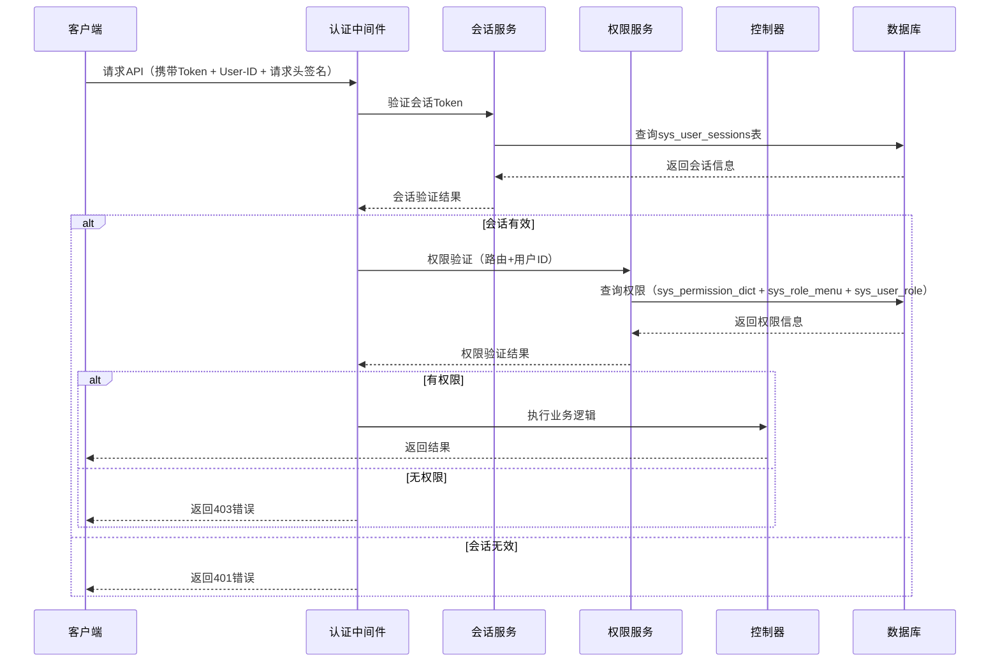

# 权限验证流程设计文档

## 一、整体流程概述



## 二、详细流程步骤

### 2.1 登录流程
1. **用户登录验证** → 验证用户名密码
2. **生成JWT Token** → 包含用户ID、设备类型等信息
3. **记录会话信息** → 写入`sys_user_sessions`表
4. **返回Token** → 前端保存到localStorage或cookie

### 2.2 权限验证流程
1. **请求拦截** → 认证中间件拦截所有需要权限的请求
2. **签名验证** → 验证API请求签名防止篡改和重放攻击
3. **Token验证** → 验证JWT Token的有效性和过期时间
4. **会话检查** → 查询`sys_user_sessions`表验证会话状态
5. **路由权限匹配** → 根据请求路径和方法查询`sys_permission_dict`表
6. **用户权限查询** → 通过用户角色关联查询用户是否拥有该权限
7. **权限判断** → 有权限则放行，无权限则返回403

## 三、数据库表关联关系

```
用户权限查询路径：
sys_user → sys_user_role → sys_role → sys_role_menu → sys_menus → sys_permission_dict
```

## 四、需要创建的文件结构

### 4.1 中间件层 (`app/middleware/`)
- `SignMiddleware.php` - API签名验证中间件
- `JwtAuthMiddleware.php` - JWT认证中间件
- `PermissionMiddleware.php` - 权限验证中间件

### 4.2 服务层 (`app/service/`)
- `AuthService.php` - 认证服务
- `PermissionService.php` - 权限服务  
- `SessionService.php` - 会话管理服务
- `JwtService.php` - JWT Token服务

### 4.3 控制器层 (`app/controller/`)
- `auth/` 文件夹
  - `LoginController.php` - 登录控制器
  - `LogoutController.php` - 登出控制器

### 4.4 模型层 (`app/model/`)
已存在的模型可以直接使用：
- `auth/MenusModel.php` ✓
- `auth/SysRoleMenuModel.php` ✓ 
- `auth/SysUserRoleModel.php` ✓
- `system/SysPermissionDictModel.php` ✓
- `system/SysUserModel.php` ✓
- `system/SysRoleModel.php` ✓

需要新增：
- `auth/SysUserSessionsModel.php` - 用户会话模型

### 4.5 工具类 (`app/utils/`)
- `HttpCode.php` - HTTP状态码常量类（简洁直观的状态码定义）
- `SignHelper.php` - API签名工具类
- `DeviceHelper.php` - 设备识别工具类
- `JwtHelper.php` - JWT工具类
- `PermissionHelper.php` - 权限辅助类

### 4.7 异常处理
使用全局常量，IDE会自动识别并提供代码提示：

```php
// 使用全局常量（简洁直观）
api_error('Token无效', HTTP_UNAUTHORIZED);           // 401
api_error('权限不足', HTTP_FORBIDDEN);               // 403  
api_error('接口不存在', HTTP_NOT_FOUND);            // 404
api_error('参数错误', HTTP_BAD_REQUEST);             // 400

// 开发环境添加调试信息
api_error('Token验证失败', HTTP_UNAUTHORIZED, [
    'token_payload' => $payload,
    'user_id_from_header' => $userId,
    'user_id_from_token' => $tokenUserId
]);

// 在条件判断中使用
if ($user->status !== 1) {
    api_error('账户已被禁用', HTTP_UNAUTHORIZED);
}

// 在返回成功时使用
return json(['msg' => '操作成功'], HTTP_SUCCESS);
```

**优势：**
- **IDE智能提示**：输入 `HTTP_` 会自动提示所有状态码
- **全局可用**：无需引入，任何地方都能直接使用
- **简洁明了**：`HTTP_FORBIDDEN` 比数字 `403` 更易读
- **防止错误**：IDE会检查常量是否存在
- **统一规范**：避免项目中状态码不一致

## 五、核心实现逻辑

### 5.1 API签名验证中间件流程
```php
1. 从请求头获取签名相关参数
   - 无X-Sign：api_error('缺少签名参数', HTTP_BAD_REQUEST)
   - 无X-Timestamp：api_error('缺少时间戳参数', HTTP_BAD_REQUEST)
   - 无X-Nonce：api_error('缺少随机字符串参数', HTTP_BAD_REQUEST)

2. 验证时间戳（防重放攻击）
   - 时间戳过期（>5分钟）：api_error('请求已过期', HTTP_BAD_REQUEST)

3. 根据用户ID或应用ID获取API密钥

4. 生成服务端签名并比较
   - 签名不匹配：api_error('签名验证失败', HTTP_UNAUTHORIZED)

5. 验证通过，继续后续流程
```

### 5.2 JWT认证中间件流程
```php
1. 从请求头获取Authorization Bearer Token和User-ID
   - 无Token：api_error('缺少认证Token', HTTP_UNAUTHORIZED)
   - 无User-ID：api_error('缺少用户ID', HTTP_BAD_REQUEST)

2. 自动识别设备类型（通过User-Agent）
   - 解析User-Agent识别：iOS、Android、Windows、Mac、Linux、其他

3. 验证JWT Token格式和签名
   - 格式错误：api_error('Token格式无效', HTTP_UNAUTHORIZED)
   - 签名无效：api_error('Token签名无效', HTTP_UNAUTHORIZED)
   - Token过期：api_error('Token已过期', HTTP_UNAUTHORIZED)

4. 解析Token获取用户ID和其他信息

5. 验证Token中的用户ID与请求头User-ID是否一致
   - 不一致：api_error('用户身份验证失败', HTTP_UNAUTHORIZED)

6. 查询sys_user_sessions表验证会话（根据用户ID和识别的设备类型）
   - 会话不存在：api_error('会话不存在', HTTP_UNAUTHORIZED)
   - 会话已过期：api_error('会话已过期', HTTP_UNAUTHORIZED)
   - 用户被禁用：api_error('账户已被禁用', HTTP_UNAUTHORIZED)

7. 验证Token是否与数据库中存储的Token一致
   - Token不匹配：api_error('会话已失效，请重新登录', HTTP_UNAUTHORIZED)

8. 更新最后活跃时间

9. 将用户信息和设备信息注入到Request中
```

### 5.3 权限验证中间件流程
```php
1. 从Request中获取已认证的用户ID

2. 获取当前请求的路径和HTTP方法

3. 查询sys_permission_dict表获取权限标识
   - 接口不存在：api_error('接口不存在', HTTP_NOT_FOUND)
   - 接口已禁用：api_error('接口暂时不可用', HTTP_SERVICE_UNAVAILABLE)

4. 检查该接口是否为公开接口(is_public=1)
   - 是公开接口：直接放行

5. 如果需要权限验证，使用用户ID查询用户权限

6. 通过用户角色关联查询是否拥有该权限
   - 无权限：api_error('权限不足，无法访问该资源', HTTP_FORBIDDEN)
   - 角色被禁用：api_error('角色已被禁用', HTTP_FORBIDDEN)

7. 记录操作日志到sys_operation_logs表（包含用户ID）
```

### 5.4 权限查询SQL逻辑
```sql
-- 查询用户是否拥有某个权限
SELECT COUNT(*) FROM sys_permission_dict spd
JOIN sys_menus sm ON spd.id = sm.perm_dict_id  
JOIN sys_role_menu srm ON sm.id = srm.menu_id
JOIN sys_user_role sur ON srm.role_id = sur.role_id
WHERE sur.user_id = ? 
  AND spd.api_path = ? 
  AND spd.http_method = ?
  AND spd.status = 1
  AND sm.status = 1
```

## 六、请求头格式要求

### 6.1 前端请求头设置
```javascript
// 前端每次请求都需要携带以下请求头
headers: {
    'Authorization': 'Bearer ' + jwt_token,
    'User-ID': user_id,
    'X-Timestamp': Math.floor(Date.now() / 1000), // 当前时间戳
    'X-Nonce': generateRandomString(16),          // 16位随机字符串
    'X-Sign': generateSign(params, api_secret),   // 生成的签名
    'Content-Type': 'application/json'
}

// 设备信息由后端自动识别，无需前端传递
// 后端通过User-Agent自动识别：iOS、Android、Windows、Mac、Linux等
```

### 6.2 设备自动识别机制
```php
// 通过User-Agent自动识别设备类型，无需前端传递
// 支持识别的设备类型：
$deviceTypes = [
    'iOS'     => 'iPhone|iPad|iPod',
    'Android' => 'Android',
    'Windows' => 'Windows NT',
    'Mac'     => 'Macintosh|Mac OS X',
    'Linux'   => 'Linux',
    'Other'   => 'default' // 其他设备
];

// 识别示例User-Agent：
// iOS: Mozilla/5.0 (iPhone; CPU iPhone OS 14_0 like Mac OS X) AppleWebKit/605.1.15
// Android: Mozilla/5.0 (Linux; Android 10; SM-G975F) AppleWebKit/537.36
// Windows: Mozilla/5.0 (Windows NT 10.0; Win64; x64) AppleWebKit/537.36
```

### 6.3 安全验证机制
1. **API签名验证**：通过请求头X-Sign防止请求参数被篡改和重放攻击
2. **双重身份验证**：Token中的用户ID必须与请求头User-ID一致
3. **会话校验**：Token必须与数据库中存储的Token匹配
4. **设备限制**：每种设备类型只能有一个活跃会话（自动识别设备）
5. **时间戳验证**：请求时间戳5分钟内有效，防止重放攻击

## 七、配置文件

### 7.1 JWT配置 (`config/jwt.php`)
```php
return [
    'secret' => env('JWT_SECRET', 'your-secret-key'),
    'ttl' => env('JWT_TTL', 7200), // 2小时
    'refresh_ttl' => env('JWT_REFRESH_TTL', 20160), // 2周
    'algo' => 'HS256',
    'user_id_header' => 'User-ID', // 用户ID请求头名称
    'sign_headers' => [ // 签名相关请求头名称
        'timestamp' => 'X-Timestamp',
        'nonce' => 'X-Nonce', 
        'sign' => 'X-Sign'
    ],
];
```

### 7.2 权限配置 (`config/permission.php`)
```php
return [
    'skip_routes' => [ // 跳过权限验证的路由
        '/api/auth/login',
        '/api/auth/register', 
        '/api/public/*'
    ],
    'super_admin_id' => 1, // 超级管理员ID
];
```

### 7.3 API签名配置 (`config/api.php`)
```php
return [
    'sign_enabled' => env('API_SIGN_ENABLED', true), // 是否启用签名验证
    'sign_timeout' => 300, // 签名有效期（秒），默认5分钟
    'secrets' => [
        // API密钥配置，可以根据用户ID或应用ID设置不同密钥
        'default' => env('API_SECRET', 'your-default-secret-key'),
        'app_001' => 'your-app-001-secret-key',
        'app_002' => 'your-app-002-secret-key',
    ],
    'skip_sign_routes' => [ // 跳过签名验证的路由
        '/api/auth/login',
        '/api/auth/register',
        '/api/public/*'
    ],
];
```

## 八、实现优先级

1. **第一阶段：基础安全**
   - ClientEnum优化（已完成）
   - SignHelper、DeviceHelper
   - SignMiddleware、配置文件设置

2. **第二阶段：认证体系**
   - JwtService、SessionService
   - JwtAuthMiddleware
   - LoginController、SysUserSessionsModel

3. **第三阶段：权限控制**  
   - PermissionService
   - PermissionMiddleware
   - 权限辅助工具

4. **第四阶段：完善功能**
   - 操作日志记录
   - 性能优化（缓存等）
   - 监控和统计

## 九、安全考虑

1. **API签名安全**：
   - 使用时间戳防重放攻击（5分钟有效期）
   - 随机字符串nonce增加签名唯一性
   - MD5签名算法，密钥与参数拼接加密

2. **Token安全**：
   - JWT使用强密钥，设置合理过期时间
   - Token存储在数据库，支持主动失效

3. **会话管理**：
   - 每种设备类型只允许一个活跃会话
   - 会话超时自动清理

4. **身份验证**：
   - Token中用户ID与请求头双重验证
   - 支持IP地址验证机制

5. **审计安全**：
   - 所有权限验证操作记录日志
   - 失败尝试次数监控

## 十、性能优化

1. **缓存策略**：权限信息可缓存到Redis
2. **索引优化**：数据库表已添加必要索引
3. **批量查询**：减少数据库查询次数
4. **中间件顺序**：认证中间件在权限中间件之前 